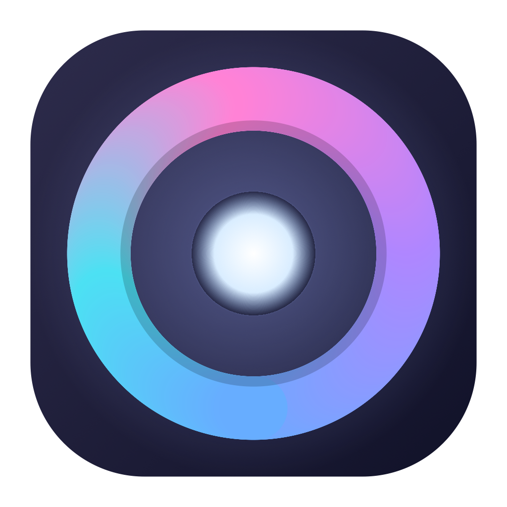

<div align="center">



# DiskAura

**A native macOS disk analyzer, cleaner, and AI-powered file organizer — everything on-device, everything reversible.**

</div>

---

DiskAura shows you exactly what's eating your disk, safely reclaims junk, finds duplicate and look-alike
files, and can tidy your folders using natural language — all with an on-device AI that never sends your
files anywhere. Nothing it does is a one-way door: every clean and move is recoverable.

## Features

- **Disk Scan** — an interactive sunburst visualization of any folder, drill in and act in place.
- **System Data explainer** — breaks down the mysterious "System Data" chunk into named, reclaimable
  buckets, and shows what's genuinely system-managed and shouldn't be touched.
- **Cleanup** — finds safe-to-remove caches, logs, developer caches, and other junk; everything goes to
  the Trash (recoverable), never a hard delete.
- **Large & Old Files** — surfaces big, stale files with a confidence score and a plain reason for each.
- **Duplicates** — byte-identical matches *and* look-alike photos (resized, edited, re-exported) via
  on-device image analysis.
- **AI Organizer** — sorts a folder into a sensible nested tree by reading each file's content
  on-device (e.g. `Documents/Company/Invoices`, `Photos/People`), not just its name.
- **Smart Rules** — describe a tidy-up in plain English ("move PDFs older than 30 days to Archive",
  "organize my Downloads by type") and it parses and runs the rule locally.
- **Assistant** — ask "why is my disk full?" and get a grounded, on-device answer based on your real data.
- **App Uninstaller** — removes apps *and* the leftovers they hide, with admin escalation for
  root-owned apps, plus a background watcher that catches leftovers when you trash an app in Finder.
- **Recovery** — a session history of everything moved or cleaned, each with one-click undo.
- **Scheduled maintenance** — optional set-and-forget auto-clean of safe junk to the Trash.
- **Menu-bar glance** — live free space, memory, CPU, and temperature.

## Privacy

DiskAura runs entirely on your Mac. The AI features use Apple's on-device Foundation Models — file
names, contents, and disk facts never leave the device, and there is no telemetry or network use.

## Requirements

- **macOS 14** or later to run.
- **macOS 26 (Tahoe) on Apple Silicon** for the on-device AI features (AI Organizer, Smart Rules,
  Assistant). Everything else works without them.

## Build from source

Requires [Xcode](https://developer.apple.com/xcode/) and [XcodeGen](https://github.com/yonaskolb/XcodeGen).

```bash
brew install xcodegen
git clone <your-fork-url> DiskAura
cd DiskAura
xcodegen generate
open DiskAura.xcodeproj   # then Build & Run
```

Or from the command line:

```bash
xcodegen generate
xcodebuild -project DiskAura.xcodeproj -scheme DiskAura -configuration Release build
```

The build is signed with a local development certificate. On first launch, right-click the app and
choose **Open** to get past Gatekeeper (a normal step for locally-signed apps).

## Contributing

Issues and pull requests are welcome. The codebase follows a plain layered structure
(`Views` / `ViewModels` / `Services` / `Models`), with each feature isolated in its own service.

## License

DiskAura is released under the [BSD 3-Clause License](LICENSE).

Copyright © 2026 Fromcode 119
